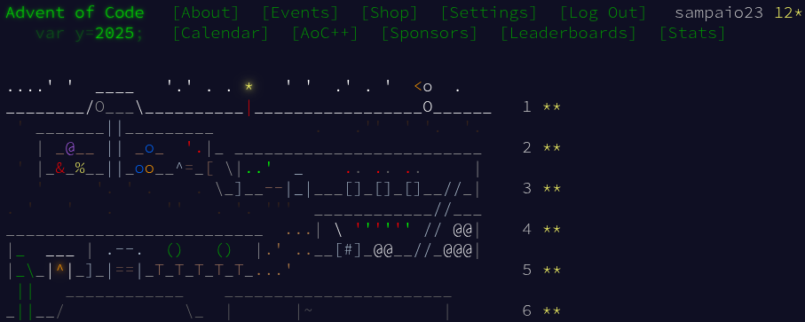

# Advent of Code 2025 - In Rust

Solutions to Advent of Code 2025 in Rust. Using this as an experiment to learn
Rust using only the API documentation and the
[Rust By Example](https://doc.rust-lang.org/rust-by-example/index.html) book.



## Running the Solutions

Build and run it using cargo:

```sh
cargo build
# cargo run --bin <day>, for example:
cargo run --bin 01
```
